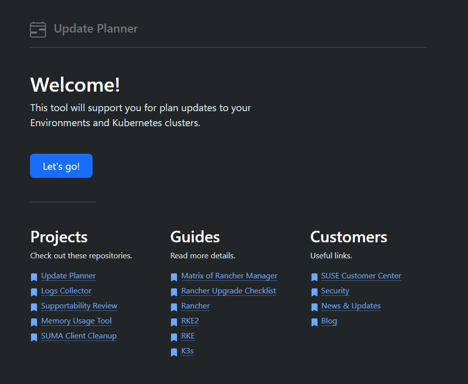
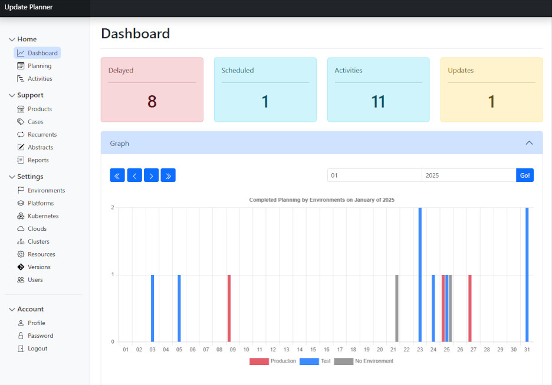
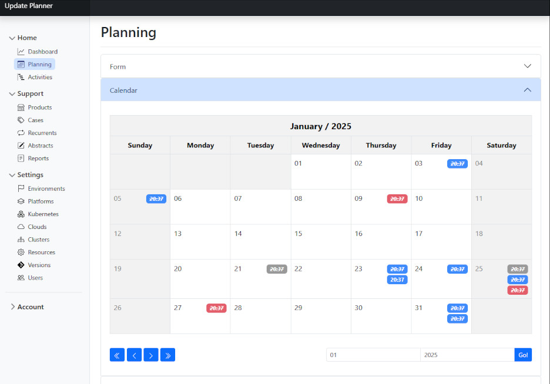
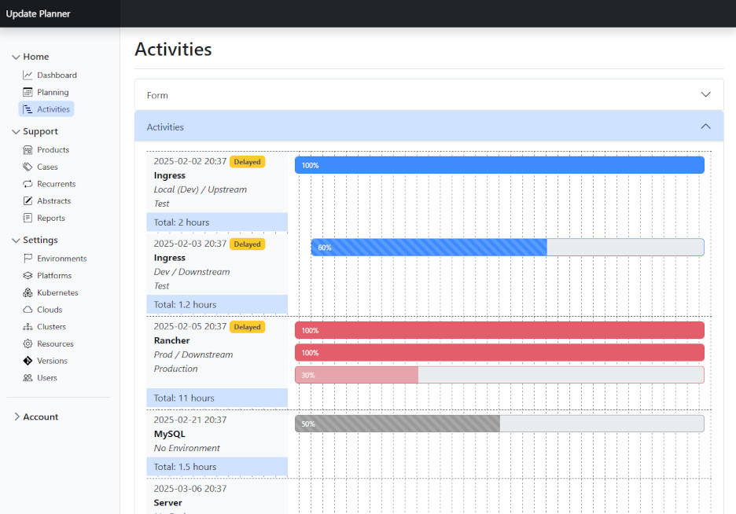

# dobzinski-updateplanner
A tool for plan updates to environments and kubernetes clusters, with dark or light themes for you to use.

## About
If you want to plan your environment upgrade activities, this tool will help you. Get a dashboard with graphs of completed schedules, a large calendar for scheduling, and use the activity items for more details on the schedules.

## Screenshots
Take a look!

## Install

## Configurations